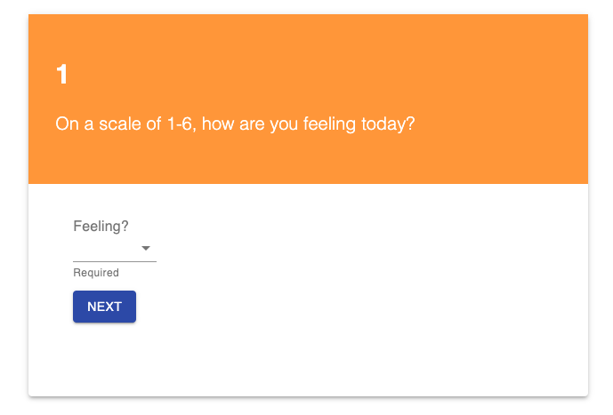

# Feedback Form

## Description

This is a feedback form that allows a user to rate their feeling, understanding, and support on a scale of 1-6, and leave a comment.  The app uses redux to collect data across the pages and ultimately updates the database when the user clicks submit at the end.

## Screenshot

This is a screenshot of the first page you will see after you click START.

## Built With

* Node.js
* Express
* Postgres
* React
* Redux
* HTML
* CSS
* Material UI

## Installation

1. Create a database named prime_feedback
1. You will see the neccessary queries in data.sql.  Make sure you have Postgres installed!  We also used Postico to run those queries.
1. Open in editor of your choice
1. Open terminal and run npm install
1. npm install pg
1. npm install react --save
1. npm install redux --save
1. npm install react-router-dom
1. Open a new terminal: npm run server
1. Open another terminal: npm run client
1. A new browser should have automatically opened for you.

## Usage

You should be able to enter in feedback, see your results at the end, and submit your feedback.

1. Click START
1. There is a dropdown menu of choices 1-6.
1. You will not be able to click next if a number is not selected.
1. Click the dropdown to choose a number.
1. Click NEXT
1. Repeat steps 4 and 5 for the Understanding and Support
1. If you want, leave a comment!
1. Review your feedback and click SUBMIT

## Acknowledgement

Thanks to Emerging Digital Academy who equipped and helped me to make this application a reality.

## Support

If you have any questions or issues, please email me at baileyniemiller@gmail.com
